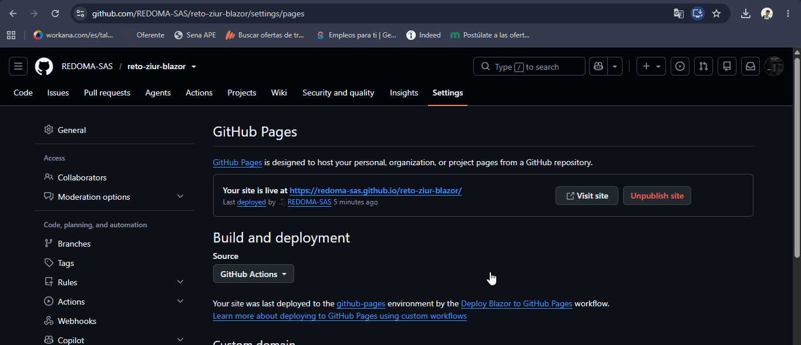

# Reto técnico — Ziur Software

Solución al reto técnico solicitado por Ziur Software: una aplicación Blazor que consume una API REST y despliega los datos en una grilla (QuickGrid).

## Estructura del proyecto

- `RetoZiur.Api` — API REST (ASP.NET Core Minimal API) que expone el endpoint `GET /api/items`.
- `RetoZiur.Web` — Aplicación Blazor WebAssembly que consume la API y muestra los datos en una grilla.

## Cómo ejecutarlo en local

Requisitos: [.NET SDK 8.0+](https://dotnet.microsoft.com/download)

1. Clona el repositorio.
2. En una terminal, dentro de `RetoZiur.Api`, ejecuta:
```bash
   dotnet run
```
3. En otra terminal, dentro de `RetoZiur.Web`, ejecuta:
```bash
   dotnet run
```
4. Abre en el navegador la URL que indique la terminal de `RetoZiur.Web`.

## Demo en vivo

- Frontend (Blazor WebAssembly): https://redoma-sas.github.io/reto-ziur-blazor/
- API (backend): https://retoziur-api.onrender.com/api/items

> Nota: la API está desplegada en el plan gratuito de Render, que "duerme" tras un periodo de inactividad. Si la grilla tarda unos segundos en cargar la primera vez, es normal porque el servicio está "despertando".

## Vista previa



## Tecnologías usadas

- ASP.NET Core Minimal API
- Blazor WebAssembly (.NET)
- QuickGrid con columnas personalizadas (badges de estado)
- HttpClient con inyección de dependencias y autenticación Bearer Token
- Manejo de estados de carga y error con opción de reintento
- GitHub Actions para despliegue automático (CI/CD)

## Consumo de API

La aplicación consume la API REST oficial de Ziur Software (`DocumentosFillsCombos`), autenticada mediante Bearer Token. Por seguridad, el token no se encuentra en el código fuente: se inyecta en tiempo de build a través de GitHub Secrets, reemplazando un placeholder en `appsettings.json` durante el proceso de despliegue (ver `.github/workflows/deploy.yml`).

> Nota: al tratarse de una aplicación 100% cliente (Blazor WebAssembly), el token es visible en las peticiones de red mientras la app corre en el navegador — esta es una limitación inherente a cualquier SPA sin backend intermediario, no un descuido de seguridad.

## Autor

Cesar Barrios Miranda — Full Stack Developer
